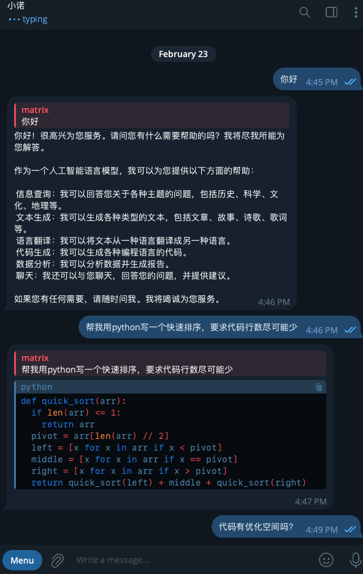

# Telegram Gemini Bot
> One-click deployment of a Telegram bot using the Gemini API

## Preview

## Prerequisites (Must-Read)
### GEMINI_API_KEY
When using the Gemini API, developers need an exclusive API key to use. Follow the [official instructions](https://ai.google.dev/tutorials/web_quickstart?hl=zh-cn#set-up-project) to apply for it.
### TGBOT_TOKEN
After creating a Telegram bot, you need to obtain a specific token to use this bot to send messages or configure other behaviors.
Initiate a conversation with [@BotFather](https://t.me/botfather) to request the bot until you acquire the token.
You can refer to the [complete guide](https://core.telegram.org/bots/tutorial).

### DOMAIN
Since this project utilizes the Telegram bot webhook to receive messages, it requires setting the callback address for the bot to your deployed project address.
After deploying with `vercel`, if you haven't altered the repository name, fill in the form `https://telegram-gemini-bot-{{github user name}}-projects.vercel.app`.
Other available addresses include:
+ `https://telegram-gemini-{{random suffix}}.vercel.app`
+ `https://telegram-gemini-bot-{{github user name}}-projects.vercel.app`
+ `https://telegram-gemini-bot-git-main-{{github user name}}-projects.vercel.app`

## Getting Started with Deployment
1. Click  
2. Follow the Vercel instructions to link your GitHub account and create a repository.
3. When prompted to fill in environment variables, enter your `GEMINI_API_KEY` and `TGBOT_TOKEN`.
4. Fill in the `DOMAIN` environment variable in the format `https://telegram-gemini-bot-{{github user name}}-projects.vercel.app`. If you input an incorrect address at this step, you can also modify the environment variables after deployment and restart the task to apply the correct address.
5. Visit the successfully deployed project page, click `Enable bot message callback`, and then the page will refresh, displaying the correct webhook setup information, indicating that it has taken effect.
6. Chat with the Telegram bot you created to verify if message handling is correct.
